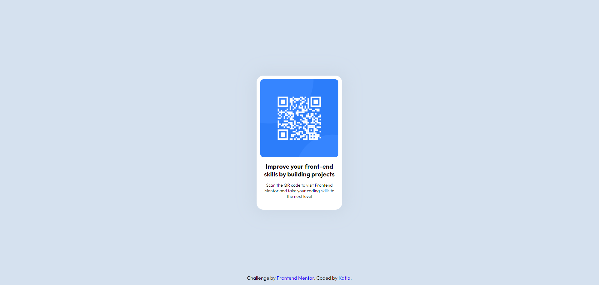

# Frontend Mentor - QR code component solution

This is a solution to the [QR code component challenge on Frontend Mentor](https://www.frontendmentor.io/challenges/qr-code-component-iux_sIO_H). Frontend Mentor challenges help you improve your coding skills by building realistic projects. 

## Table of contents

- [Overview](#overview)
  - [Screenshot](#screenshot)
- [My process](#my-process)
  - [Built with](#built-with)

## Overview
- This web is meant to give to a possible user of **Frontend Mentor** the QR code that will send them to the main page of the challenge. 
- Tecnologies: *HTML, CSS*

### Screenshot

## My process
The build of this tiny project was kind of a challenge for me, since I'm a little rusty on html and css, but with some help of google I could overcome it. 
The hardest part was to center the box of the content, I hadn't fully understanded the distinctions between align/justify, items/contents. 

*I want to keep improving my habilities on building fuller and bigger sites, acknowleging the tools and understanding that everything takes time and practice*

### Built with

- Semantic HTML5 markup
- CSS custom properties
- Flexbox
- CSS Grid

